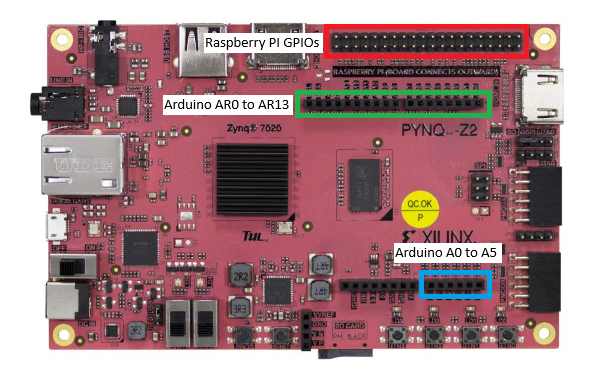

# GPIO Support

This document explains how GPIO control is implemented in LoCod and how to use it.

The GPIO feature allows software running on the CPU to directly control physical FPGA board pins through a memory-mapped AXI GPIO peripheral implemented in the FPGA design.

Due to the fact that GPIOs are different from a board to another and that we've only implemented this feature for PYNQ Z2 board. At that time this document will be focussed arround the PYNQ Z2 board implementation. With that said this feature was implemented in the intention to be esily portable to other boards...   


# Functionality Overview

## How it works

LoCod GPIO support relies on a memory-mapped AXI GPIO peripheral instantiated in the FPGA design.

The overall architecture is the following:

```text
CPU
 |
 | Memory-mapped access
 v
AXI GPIO Peripheral
 |
 | GPIO signals
 v
FPGA Top-Level
 |
 | XDC constraints
 v
Physical Board Pins
```

The CPU accesses a dedicated physical address where the AXI GPIO peripheral is exposed. By reading and writing the GPIO registers, software can:

- Configure a pin as input or output
- Drive a pin HIGH or LOW
- Read the current state of a pin

Under Linux, the peripheral is accessed through `/dev/mem` and `mmap()`. Under baremetal, the physical address is accessed directly.


## Board-specific implementation

GPIO support is inherently **board-specific**.

While the software API remains generic, the actual GPIO implementation depends on the target platform because every FPGA board has its own:

- Physical connectors
- Available GPIO pins
- FPGA top-level signals
- XDC constraints
- AXI address mapping
- GPIO peripheral configuration

As a consequence, GPIO support cannot simply be enabled on any board without FPGA-side integration.

A dedicated FPGA implementation must be provided for each supported board to:

1. Instantiate and configure the AXI GPIO peripheral.
2. Connect the GPIO signals to the desired FPGA top-level ports.
3. Associate these ports with physical package pins in the XDC constraints.
4. Define the physical address used by the software driver.


## CPU-only control

GPIOs are controlled exclusively from the CPU side.

The generated accelerators do not directly drive these GPIO pins.

Instead, software executes memory accesses to the AXI GPIO peripheral and the FPGA routes the resulting signals to the physical pins.

The data path is therefore:

```text
CPU Software
      |
      v
AXI GPIO Registers
      |
      v
FPGA GPIO Signals
      |
      v
PYNQ-Z2 Physical Pins
```


## FPGA implementation

For the PYNQ-Z2 design, a Xilinx AXI GPIO IP is instantiated and connected to the processing system through AXI. The GPIO IP is configured in dual-channel mode, and it's adress is physically mapped (at 0x41200000). Two GPIO channels are exposed from the base (gpio_rtl_0 and gpio_rtl_1). These channels are connected to the physical pins through the FPGA top-level design by using the xdc defined pins.


## GPIO register organization

The LoCod GPIO driver uses the following AXI GPIO registers offsets:

```c
#define GPIO_DATA   0
#define GPIO_TRI    1

#define GPIO2_DATA  2
#define GPIO2_TRI   3
```

### Data registers

Used to read or write GPIO values.

```text
GPIO_DATA
GPIO2_DATA
```

### Direction registers

Used to configure GPIO direction.

```text
0 = OUTPUT
1 = INPUT
```

```text
GPIO_TRI
GPIO2_TRI
```


# Using GPIOs on PYNQ-Z2

## ⚠️ 3.3 V Only

**All GPIOs exposed by this implementation operate at 3.3 V logic levels.**
Applying voltages above 3.3 V may permanently damage the board.

## ⚠️ Digital GPIOs Only

**All GPIOs are digital-only.**
This feature only supports:
- `HIGH`
- `LOW`

Even pins located on the Arduino analog header (`A0` to `A5`) are used strictly as digital GPIOs within this implementation.
Analog acquisition is not supported by the LoCod GPIO API.


## Available GPIOs on PYNQ-Z2

The current implementation exposes a total of **45 GPIO pins**:


- Raspberry Pi GPIO Header
- Arduino Digital Header (`AR0` → `AR13`)
- Arduino Analog Header (`A0` → `A5`)

They are located on the board at theses locations: 

<br>


## Available functions

### GPIO initialization

Initializes the GPIO peripheral and maps the GPIO registers.

```c
init_gpio();
```

---

### Configure pin direction


```c
gpio_pin_mode(PIN_AR0, OUTPUT);
gpio_pin_mode(PIN_AR1, INPUT);
```


### Write a GPIO value


```c
gpio_pin_write(PIN_AR0, HIGH);
gpio_pin_write(PIN_AR0, LOW);
```


### Read a GPIO value


```c
int state = gpio_pin_read(PIN_AR1);

if (state == HIGH){
    printf("Pin is HIGH\n");
}
else{
    printf("Pin is LOW\n");
}
```


### GPIO deinitialization

Releases the GPIO resources.


```c
deinit_gpio();
```


## Minimal example

The following example configures `PIN_AR0` as an output and toggles it:

```c
#include "locod.h"

int main(void)
{
    init_gpio();

    gpio_pin_mode(PIN_AR0, OUTPUT);

    gpio_pin_write(PIN_AR0, HIGH);

    sleep(1);

    gpio_pin_write(PIN_AR0, LOW);

    deinit_gpio();

    return 0;
}
```


## Example project

A complete GPIO usage example is available in:

```text
demo/simple-gpio/main.c
```

This example demonstrates:

- GPIO initialization
- Pin direction configuration
- Digital output control
- Digital input reading
- GPIO deinitialization


# Summary

The current GPIO implementation provides CPU-side access to physical PYNQ-Z2 pins through a memory-mapped AXI GPIO peripheral.

Key points:

- Implemented and validated on **PYNQ-Z2**
- GPIO mapping is **board-specific**
- Controlled from the **CPU side**
- Supports Arduino and Raspberry Pi headers
- **3.3 V logic only**
- **Digital GPIO only**
- Arduino `A0` to `A5` are used as digital pins
- Usage example is available in `demo/simple-gpio/main.c`