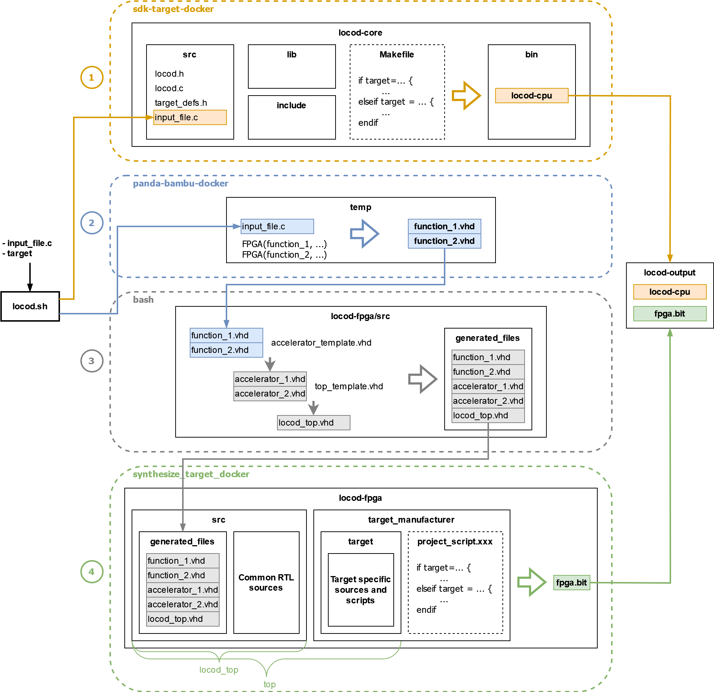

# LoCod operation

In this document, we'll look at how the LoCod tool works, i.e. the various steps involved in going from C code with functions to be executed in FPGA, to a complete FPGA CPU co-design ready to be flashed on the target with an executable and a bitstream.

The diagram below shows the main stages in LoCod operation:

 

## 1. Compiling C code

To compile the CPU code, the C input file supplied by the user is copied into the locod-core/src folder. The locod-core folder contains a classic C Makefile project, which integrates the LoCod API C sources (locod.c, locod.h, ...). Adding the user's file, renamed main.c, completes this C project which is then ready to be compiled. Compilation is then done via a classic Makefile, by linking the locod-core directory into the SDK Docker specific to the chosen target. Within the Makefile, various parts are included or excluded to modify the compilation options, libraries and link files, according to the chosen target.

## 2. Generating RTL code of accelerators functions

In this step we first define a variable FGA_FUNC, containing all the functions passed to FPGA() macros in the C code. Then, we copy the C user file in a temporary folder named temp. For each function in FPGA_FUNC, we launch the Panda-Bambu docker binding this folder, we convert the C function in RTL and we copy the result Verilog or VHDL file in the generated_files folder of the FPGA design (in locod-fpga).

## 3. Generating VHDL components from generated IPs

In this step, we adapt the RTL template files defined in the LoCod FPGA design sources in locod-fpga/src to the generated Bambu files. First, for each Bambu component, we create an accelerator_x.vhd component, where x is the accelerator number corresponding to the function (passed in the FPGA macro). Then we replace the NB_ACCELERATORS in the top level with the MAX_ACC_NUMBER and instantiate each accelerator component previously created. At the end of this step, the LoCod FPGA top level, locod_top component, is complete and ready for synthesis.

## 4. Synthesis of the FPGA design

Finally, the FPGA design is synthesized. Depending on the target selected by the user, a corresponding script is launched to perform the design synthesis. For example, TCL scripts are used for Xilinx targets, whereas Python scripts are used for NanoXplore. The sources of the locod_top component are imported, along with target-specific sources or other sub-scipts to configure the project correctly. The combination of locod_top and target-specific sources then constitutes the top component, which can then be synthesized in bitstream. Once synthesis is complete, the resulting bitstream is stored in the locod-outputs folder.