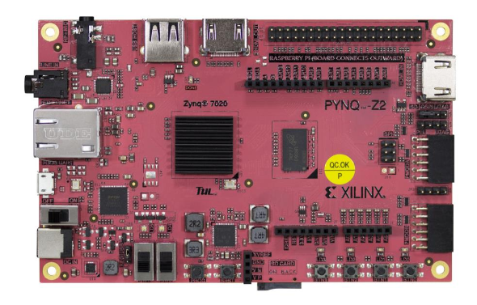
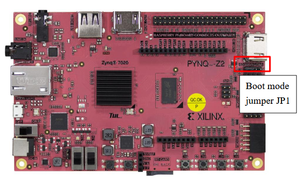
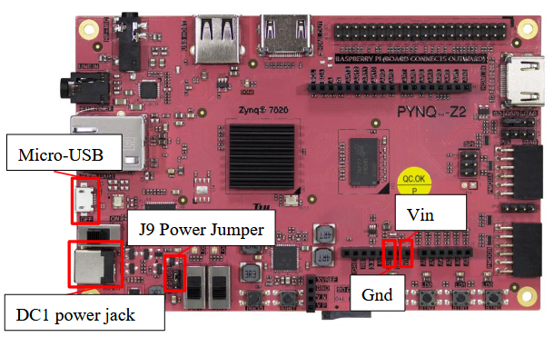

# PYNQ-Z2 Quick Start Guide
<br>

## Overview

The **PYNQ-Z2** is a development board based on the **Xilinx Zynq-7000 SoC (XC7Z020)**, combining:

- Dual-core ARM Cortex-A9 Processing System (PS)
- FPGA Programmable Logic (PL)
- DDR3 memory
- Ethernet connectivity
- USB interfaces
- Arduino and Raspberry Pi compatible headers
- General-Purpose I/O (GPIO)
- SD card slot

The board is commonly used for embedded Linux, FPGA development and hardware acceleration.

The SD card slot is utilized to boot up an embedded linux image. This gives us the advantage to have a complete linux system on the board. It's easier to test different programs on the go without having to reflash everytime an SD card or the board directly. When linux is booted on the board we can connect to it and add our files via  USB key or SFTP (network protocol). We can then run our programs directly on the board via the terminal. 


## First Boot
A jumper located on the board permits the selection of the boot mode.

<br>

Before powering the board :

1. Insert the prepared microSD card.
2. Choose the SD boot mode with the jumper (JP1).
3. Configure the power selection jumper.
4. Connect power.
5. Power on the board.
6. Wait for Linux to finish booting.

There is a blinking led on the board when you power it on, it doesn't mean linux is booted or CPU is runing ! It just means that FPGA circuit is working properly. (That LED is blinking with internal FPGA programm and not linked to anything related to CPU)

⚠️ Be extra delicate when inserting the SD card, the SD card reader is fragile ! 


## Powering the Board

<br>


To choose the power source of the PYNQ-Z2 you can move the jumper (JP9) to select the source. It can be powered using either:
- **USB** : up position → Power from Micro-USB
- **REG** : down position → Power from 12V power jack or Vin pin

Verify the jumper position before turning on the board.

⚠️ If more power is required the regulator (REG) is recommended. 


## Connecting to the Board

Possible connection types :
- Serial Console
- Ethernet / SSH Access

The easiest way to monitor boot messages and access the Linux console is through the serial interface. However, the SSH access makes it possible to connect to the board remotely, thus avoid damaging the board. It is useful when the board is shared with multiple clients remotely. If using software like MobaXterm SSH enables SSH browser : a neat way of transferring files to or from the board. 

Examples of terminal software:

- MobaXterm
- PuTTY
- screen

### Serial

You need to use this configuration to connect to the board: 

```text
Baud rate: 115200
Data bits: 8
Parity: None
Stop bits: 1
Flow control: None
```

### Ethernet / SSH Access

The board is configured with the following static IP address:

```text
IP Address : 192.168.0.10
Netmask    : 255.255.255.0
```

#### Configure Your Computer

Set a static IP address on your computer in the same subnet:

```text
IP Address : 192.168.0.x
Netmask    : 255.255.255.0
```

Where:

- `x` must be between `1` and `254`
- **Do not use** `10` (already used by the board)

Example:

```text
IP Address : 192.168.0.100
Netmask    : 255.255.255.0
```

#### Connect through SSH

Connect the board directly to your computer using an Ethernet cable.

With the tool of your choice connect to the board :

```text
IP Address : 192.168.0.10
port : 22
```


## Login Credentials

### Root

```text
Username: root
Password: <none>
```

### User

```text
Username: user
Password: user
```

## GPIO Pinout

⚠️ **All GPIO signals are 3.3V only.**

Applying higher voltages may permanently damage the board.

See the [GPIO documentation](gpio_support.md) available in this repository.

## Soft Reset

The PYNQ-Z2 provides a **soft reset button** that can be used to restart the system without disconnecting the board from power.

Pressing the soft reset button resets the **processor (CPU)** and restarts the Linux system. The FPGA configuration and power remain active.

The soft reset can be useful when:

- Linux becomes unresponsive.
- You want to restart the system without unplugging the board.
- You need to reboot after making system-level changes.

⚠️ **Any unsaved data may be lost when using the soft reset.** Make sure files and programs are saved before resetting the board.

After pressing the button, wait for Linux to boot again before reconnecting through SSH or using the terminal.

## Useful Commands

Check network configuration:

```bash
ip addr
```

Verify Ethernet connectivity:

```bash
ping 192.168.0.10
```

## Transfering Files

### USB Key

The recommended method for transferring files is using a USB key.

- Insert the USB key into one of the board's USB ports.
- Wait a few seconds for Linux to detect and mount the USB key.
- The USB key should be available under:

```text
/run/media/<your_usb_key>
````

You can check the contents of the USB key with:

```text
ls /run/media/<your_usb_key>
````

- ⚠️ Always safely unmount the USB key before removing it to avoid data corruption:
```text
umount /run/media/<your_usb_key>
````
---

## Tips

- Use the serial console when debugging boot issues.
- Ensure the microSD card is properly inserted before power-up → ⚠️ SD card reader fragile ! 
- Verify the power source jumper setting before turning on the board.
- ⚠️ GPIOs operate at **3.3V logic levels only**.
- When using Ethernet, your computer must be configured in the `192.168.0.0/24` network.